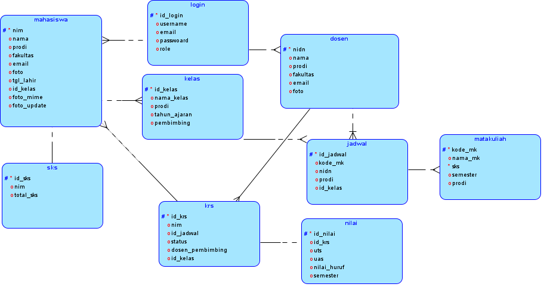

# Database KRS & KHS

Project ini merupakan **perancangan dan implementasi database** untuk sistem **Kartu Rencana Studi (KRS)** dan **Kartu Hasil Studi (KHS)**.  
Project ini dibuat sebagai bagian dari tugas perkuliahan dan portofolio di bidang **Database Management System**.

---

##  Deskripsi Project
Sistem database ini dirancang untuk mengelola data akademik mahasiswa, seperti:
- data mahasiswa
- data mata kuliah
- pengambilan mata kuliah (KRS)
- hasil studi mahasiswa (KHS)

Fokus utama project ini adalah:
- desain struktur tabel
- relasi antar tabel
- penerapan primary key dan foreign key
- konsistensi dan integritas data

## 🎯 Tujuan
- Menerapkan konsep **database relasional**
- Membuat struktur database yang rapi dan terorganisir
- Melatih pembuatan database untuk sistem akademik

## Tools & Teknologi
- **Database** : MySQL 
- **Bahasa** : SQL  
- **Tools** : phpMyAdmin 

##  Struktur Database
Database ini terdiri dari beberapa tabel utama, antara lain:
- Mahasiswa
- Mata Kuliah
- KRS
- KHS
- Dosen
- Nilai
- Sks
- Relasi antar tabel sesuai sistem akademik

Relasi database dirancang menggunakan **primary key** dan **foreign key** agar data saling terhubung dengan baik.

## 📁File dalam Repository

### Penjelasan File:
- **krskhs.sql**  
  Script SQL untuk membuat database dan tabel KRS & KHS
- **erd fiks.png**  
  Diagram ERD database
- **databse.png / Logical.png**  
  Diagram struktur dan relasi database
- **README.md**  
  Dokumentasi project

---

## 📊 Diagram Database
Berikut adalah diagram database yang digunakan dalam project ini:

### ERD

### Logical Diagram

## ⚙️ Cara Menggunakan Database
1. Buka **phpMyAdmin** atau **MySQL Workbench**
2. Buat database baru (contoh: `db_krs_khs`)
3. Import file `krskhs.sql`
4. Database siap digunakan

---

## 📌 Catatan
- Project ini fokus pada **desain database**, bukan aplikasi frontend
- Database dapat dikembangkan lebih lanjut ke sistem web, mobile, atau desktop

---

## 👩‍💻 Author
**Nazla Salsabila Aulia Bachri**  
Mahasiswa S1 Pendidikan Teknologi Informasi
Universitas Negeri Surabaya
Fokus minat: **Database & Backend System**

##  Penutup
Project ini dibuat sebagai bentuk pembelajaran dan portofolio.  
Saran dan masukan sangat diterima untuk pengembangan lebih lanjut.
